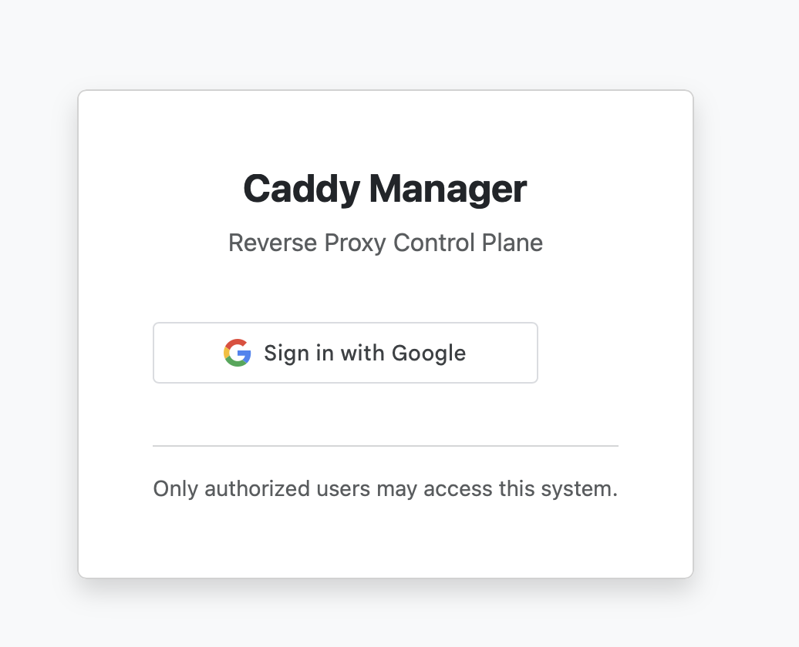
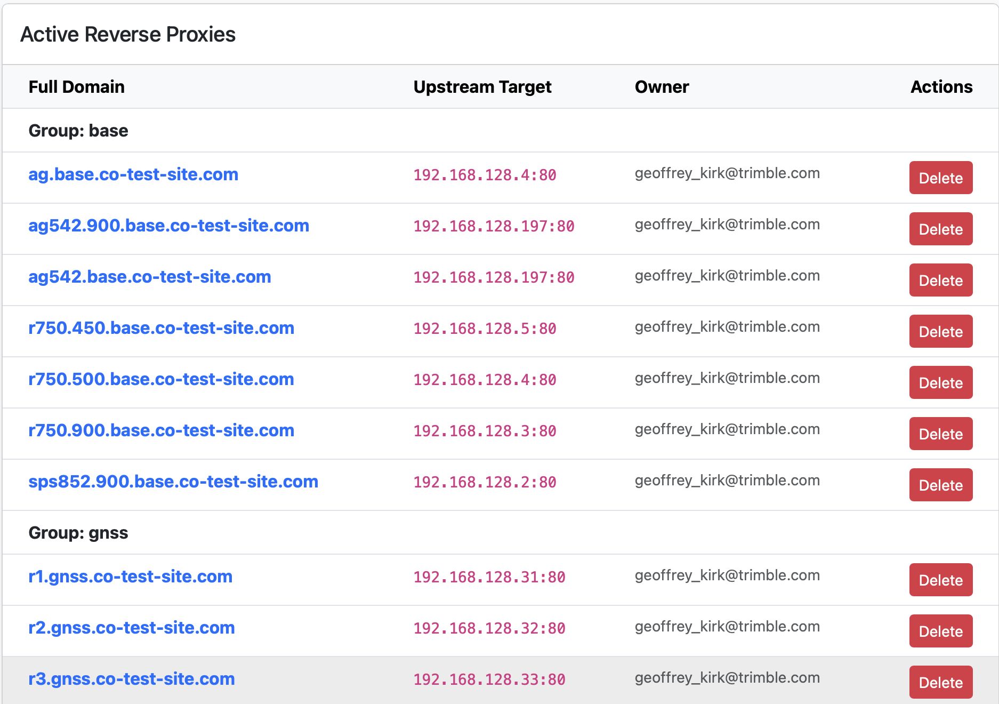
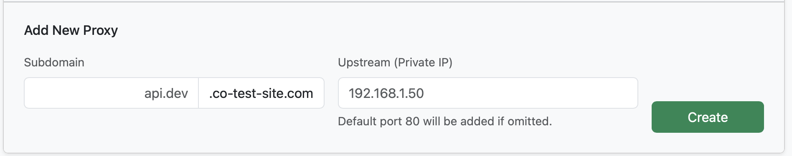
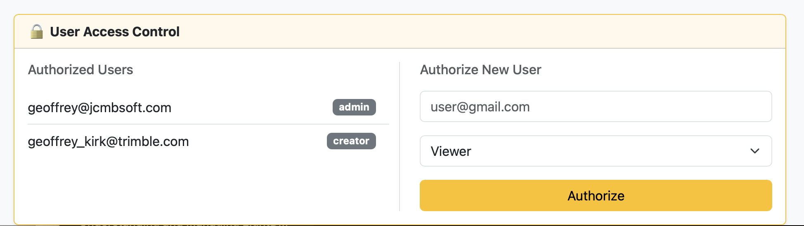

# caddy-control
Web Application Suite to control the caddy web server

Caddy control is a simple set of tools that allows for authorized users to add sub domain based https forwarding to privare addresses. 


## Usage

The application is accessed via the /CaddyCfg url. 

This will redirect to the login screen, if required



Login with your google identity. Note that the Google OAuth system may limit the systems capabilities. It is designed to allow for view only for all users in an organization. 

Once logged in you will see the list of the currently configured proxies. Depending on your role.



A normal users can delete proxies that they have added, admins can delete any proxy. 

Normal or admin users can add a proxy.



You can only add sub domains to the primary domain. The upstream IP only supports configuration of IP V4 private IP's. By default the upsteam port will be 80. 




The admin can add new users to the system with their roles. Note that the Google OAuth console must allow these users access.


##Installation

### Caddy Configuration

The caddy application needs to be configured to forward /CaddyCfg to the application 

```
domain { 
 root * /var/www/html
 file_server
 handle /CaddyCfg* {
 reverse_proxy localhost:8080
 }
```

8080 is the default port, and can be overridden in the .env file


###Caddy Control Plane - Installation Instructions


#### Step 1: Transfer to Computer

Use SCP or a USB drive to copy the files to your Pi.


#### Step 2: Install

SSH into your computer and run the following commands:


1. Enter the directory:
   cd caddy-install-pkg

2. Make the installer executable:
   chmod +x scripts/install.sh

3. Run the installer:
   ./scripts/install.sh
   
#### Step 2.5
   Fix Go 
   
    go mod download github.com/gorilla/sessions
   	go mod download github.com/joho/godotenv
	go mod download github.com/mattn/go-sqlite3
	go mod download google.golang.org/api

    go get github.com/gorilla/sessions
    go mod download github.com/gorilla/securecookie
    go get google.golang.org/api/idtoken
    go get google.golang.org/api/internal
    

#### Step 3: Configuration

The installer creates the application in /opt/caddy-control.
You MUST edit the .env file to add your Google Client ID.

1. Edit the config:
   sudo nano /opt/caddy-control/.env

   - Set GOOGLE\_CLIENT\_ID=...
   - Set SESSION_SECRET=...
   - Set ADMIN_EMAIL=...
   - Set ALLOWED_DOMAIN=... (e.g. co-test-site.com)

The GOOGLE\_CLIENT\_ID and SESSION_SECRET is from the Google OAuth console that defines the application.

ADMIN_EMAIL is the default admin user that is automatically added. That user must be added into the O-Auth console. 

ALLOWED_DOMAIN is the base domain that the forwarding is based off. 

2. Restart the service to apply changes:
   sudo systemctl restart caddy-control

#### Step 4: Verify

Check the status of the service:
   sudo systemctl status caddy-control

View logs:
   sudo journalctl -u caddy-control -f
